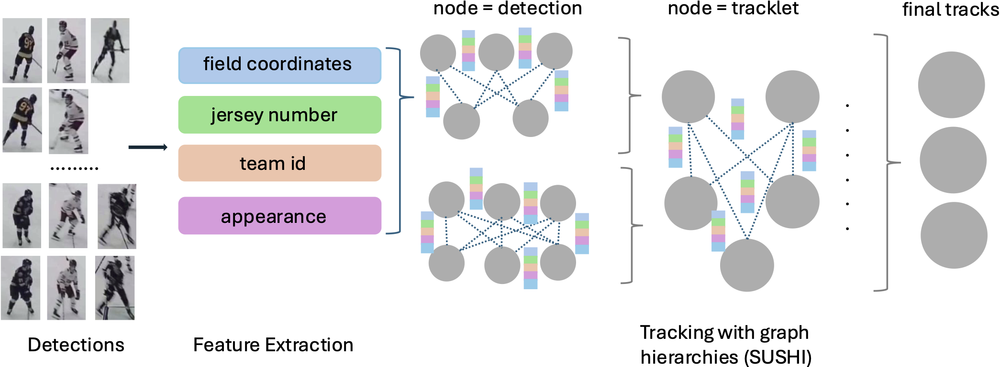
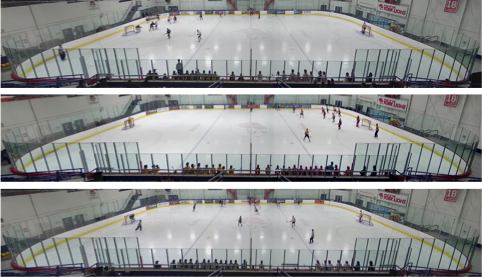

# Towards long-term player tracking with graph hierarchies and domain-specific features
Code, data, and model weights for paper [Towards long-term player tracking with graph hierarchies and domain-specific
features](https://arxiv.org/pdf/2502.21242) (Maria Koshkina, James H. Elder).

## YorkHockey Dataset:

* Request access by contacting [Maria Koshkina](mailto:koshkina@hotmail.com?subject=YorkHockey).
* Annotation files format:
  * gt/gt.txt: standard MOT annotations
  * gt/true_gt.txt: frame_id,track_id,right_x,top_y,width,height,team_id,jersey_number
    * team_id is 0 for referees, 1 or 2 for teamA or teamB.
    * jersey_number is specified if legible at any point in the track, otherwise it is -1

  
## Code:
Coming soon.

<!-- ## Requirements:
* pytorch 1.9.0
* opencv

## Setup:

## Data:

### Models:

## Inference:

## Train (Hockey)

## Train (SoccerNet)

## Citation

## Acknowledgements

## License

This work is licensed under a [Creative Commons Attribution-NonCommercial 3.0 Unported License](http://creativecommons.org/licenses/by-nc/3.0/).]:# -->
